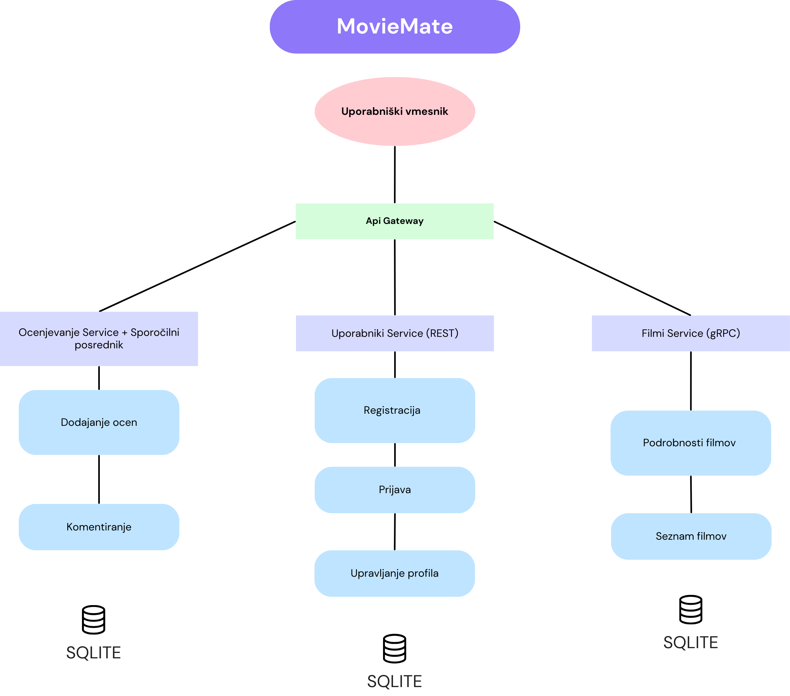

# MovieMate

## 📌 Opis projekta

Naloga je nastala v sklopu predmeta IT Arhitekture

MovieMate je sistem za sledenje in ocenjevanje ogledanih filmov. Omogoča uporabnikom, da vodijo evidenco filmov, ki so jih že pogledali, ocenjujejo filme in prebirajo ocene drugih uporabnikov.

## 🎯 Poslovni problem

**Težava:** Veliko ljubiteljev filmov želi slediti filmom, ki so jih že pogledali, ter prebirati in deliti mnenja o filmih.

**Rešitev:** MovieMate ponuja enostavno platformo, kjer lahko uporabniki:

- Beležijo filme, ki so jih že gledali.
- Ocenjujejo in komentirajo filme.
- Dodajajo filme na seznam "Želim pogledati".
- Prebirajo ocene drugih uporabnikov.

**Ciljna skupina:**

- Posamezniki, ki želijo voditi evidenco svojih ogledov.
- Ljubitelji filmov, ki želijo deliti in prebirati ocene.
- Skupine prijateljev, ki si želijo deliti svoje sezname in ocene.

## 🏗️ Arhitektura sistema

Sistem sledi mikrostoritveni arhitekturi in vključuje naslednje ključne storitve:

1. **Uporabniki service (`/uporabniki`)** - uporablja **REST API** in SQLite bazo.
   - Upravljanje uporabniških računov (registracija, prijava, avtentikacija).
   - Hranjenje uporabniških podatkov (ime, e-pošta, zgodovina ogledov).

2. **Filmi service (`/filmi`)** - uporablja **gRPC** in SQLite bazo.
   - Vsebuje podatke o filmih (naslov, leto, žanr, opis, igralci).
   - Možna integracija z zunanjimi API-ji, kot je TMDB.

3. **Ocene service (`/ocene`)** - uporablja **sporočilnega posrednika** in SQLite bazo.
   - Omogoča uporabnikom dodajanje ocen in komentarjev h filmom.
   - Shranjuje in analizira uporabniške ocene.

4. **Uporabniški vmesnik (`/uporabniski-vmesnik`)** - uporablja spletno tehnologijo - React za prikaz podatkov.
   - Spletna aplikacija, kjer uporabniki dostopajo do sistema.
   - Omogoča dodajanje filmov, ocenjevanje in pregled ocen drugih uporabnikov.

## 🔗 Komunikacija med storitvami

- **Uporabniki** komunicirajo s sistemom prek spletne aplikacije.
- **Storitev uporabnikov** upravlja prijave in uporabniške podatke prek **REST API**.
- **Storitev filmov** nudi informacije o filmih in omogoča iskanje prek **gRPC**.
- **Storitev ocen** omogoča shranjevanje in prikaz uporabniških ocen prek **sporočilnega posrednika**.
- Vse storitve uporabljajo **SQLite** za shranjevanje podatkov.

📂 **Dodatna dokumentacija:**
- [Uporabniška storitev](UporabnikiService/README.md)
- [Storitvena baza filmov](FilmiService/README.md)
- [Storitvena enota ocen](OceneService/README.md)
- [Uporabniški vmesnik](UporabniskiVmesnik/README.md)

